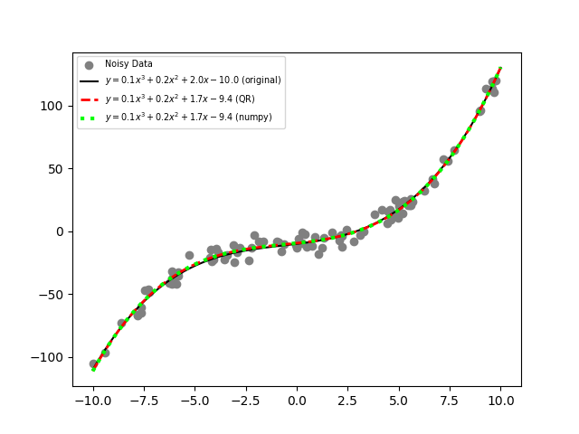

# qrls

QR decomposition based Least-Squares example code.


## Installation

This code will require `numpy` and `matplotlib` to be installed in order to work.

Clone this repo, create a wheel file and install using `pip3`:

```bash
#clone me
git clone https://github.com/mattkjames7/qrls.git
cd qrls

#create wheel file
python3 setup.py bdist_wheel
pip3 install dist/qrls-0.0.1-py3-any.whl --user

#OR install using setup.py
python3 setup.py install --user
```

## Usage

Using this code is very simple - see [qrls/Example.py](qrls/Example.py)

If using real data with `x` values and `y` values, fit a polynomial with degree `deg` :

```python
import qrls

beta = qrls.QRLeastSq(x,y,deg)
```

where `beta` is an array of polynomial coefficients, starting with the highest order.

The `Example()` function compares a QR decomposition fit to fake noisy data to a `numpy.polyfit` solution and the original equation (minus noise), e.g.:


